# Лабораторная работа № 1

## Создание виртуального окружения. Контроллеры и маршруты

**Выполнил:** Рудик Аджамян  
**Группа:** ПИЖ-б-о-25-2(1)

---

## Цель работы

Настроить виртуальное пространство Python, создать проект на Django, разработать контроллеры приложения и организовать маршруты для обработки HTTP-запросов.

---

## 1. Теоретические сведения

Виртуальное окружение Python представляет собой изолированное пространство, в котором устанавливаются необходимые для конкретного проекта библиотеки. Это позволяет отделить зависимости одного проекта от глобальных пакетов Python и других проектов.

Для создания виртуального окружения используется модуль `venv`:

```bash
python -m venv venv
```

После создания окружение активируется командой:

```bash
venv\Scripts\activate
```

Установленные библиотеки можно посмотреть с помощью команды `pip list`.

Django — веб-фреймворк Python для разработки веб-приложений. Проект Django состоит из конфигурации и одного или нескольких приложений. Контроллеры располагаются в `views.py`, а URL-маршруты задаются в `urls.py` с помощью функции `path()`.

Маршрутизатор получает запрос клиента, сравнивает его адрес с зарегистрированными маршрутами и при совпадении вызывает соответствующий контроллер. Если подходящего маршрута нет, Django возвращает ошибку 404.

---

## 2. Создание виртуального окружения

Для выполнения лабораторной работы было создано виртуальное окружение Python:

```bash
python -m venv venv
```

После выполнения команды в проекте появилась директория `venv`, содержащая файлы виртуального окружения.

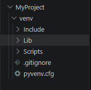

**Рисунок 1 — Создание виртуального окружения**

Для проверки установленных пакетов была выполнена команда:

```bash
pip list
```
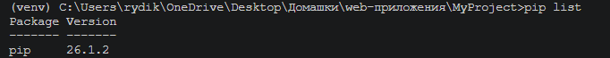

**Рисунок 2 — Активированное виртуальное окружение и список установленных пакетов.**

Виртуальное окружение было активировано командой:

```bash
venv\Scripts\activate
```

После активации в начале строки терминала появилось обозначение `(venv)`.


---

## 3. Установка Django

После активации виртуального окружения был установлен Django:

```bash
pip install Django
```

После установки была повторно выполнена команда:

```bash
pip list
```

В списке установленных пакетов появился Django и его зависимости.

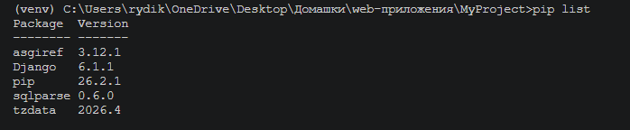

**Рисунок 3 — Установка Django и его наличие в списке пакетов**

---

## 4. Создание проекта Django

Для создания проекта использовалась команда:

```bash
django-admin startproject MySite
```

В результате была создана структура Django-проекта.

Для запуска сервера необходимо перейти в каталог проекта:

```bash
cd MySite
```

После этого выполняется:

```bash
python manage.py runserver
```

Сервер становится доступен по адресу `http://127.0.0.1:8000/`.

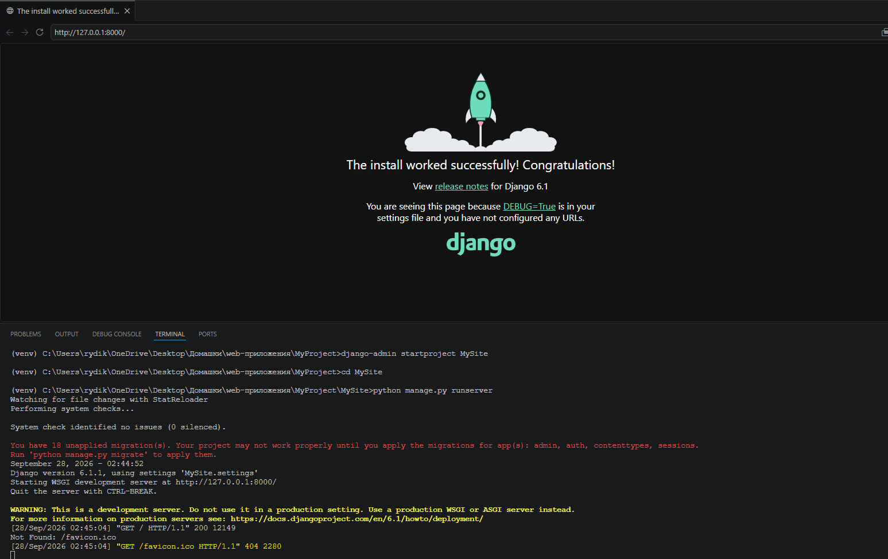

**Рисунок 4 — Запущенный Django-сервер и стандартная страница проекта в браузере.**

При переходе по указанному адресу открывается стандартная стартовая страница Django.

В терминале отображаются поступающие HTTP-запросы.

Для остановки сервера используется `Ctrl+C`.

---

## 5. Создание приложения

Для добавления пользовательского функционала было создано приложение `news`:

```bash
python manage.py startapp news
```

В результате появилась директория `news`, содержащая файлы приложения, в том числе `views.py`.

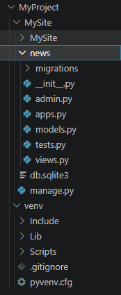

**Рисунок 5 — Созданное приложение news в структуре проекта**

Приложение было зарегистрировано в `MySite/settings.py` в списке `INSTALLED_APPS`:

```python
'news',
```

---

## 6. Создание контроллера

В файле `news/views.py` была создана функция `index`, принимающая HTTP-запрос и возвращающая HTTP-ответ:

```python
from django.http import HttpResponse


def index(request):
    return HttpResponse("Главная страница новостного приложения")
```

Объект `request` содержит информацию о полученном запросе, а `HttpResponse` используется для формирования ответа клиенту.

---

## 7. Настройка маршрута

В файле маршрутов проекта был добавлен импорт контроллера:

```python
from news.views import index
```

После этого был создан маршрут:

```python
path('news/', index)
```

Он связывает адрес `/news/` с функцией `index`.


После запуска сервера при обращении к `http://127.0.0.1:8000/news/` вызывается функция `index`.

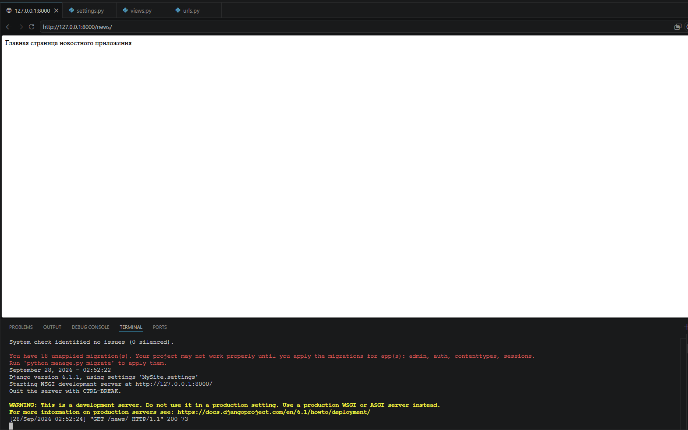

**Рисунок 6 — Результат работы маршрута /news/**

---

## 8. Работа с HTTP-запросом

Для просмотра методов и атрибутов объекта `request` была использована команда:

```python
print(dir(request))
```

После обновления страницы информация была выведена в терминал.

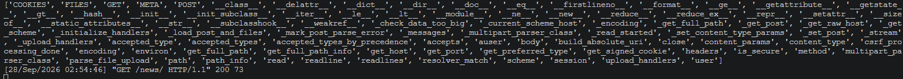

**Рисунок 7 — Вывод информации об объекте request в терминале.**

---

## 9. Создание второго контроллера

В приложении `news` был создан дополнительный контроллер `test`:

```python
from django.http import HttpResponse


def index(request):
    return HttpResponse("Главная страница новостного приложения")


def test(request):
    return HttpResponse("Тестовая страница")
```

Для него был создан соответствующий маршрут.

---

## 10. Организация маршрутов приложения

Для хранения маршрутов непосредственно внутри приложения был создан файл `news/urls.py`:

```python
from django.urls import path
from .views import index, test


urlpatterns = [
    path('', index),
    path('test/', test),
]
```
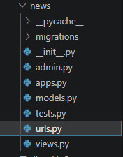

**Рисунок 8 — Файл news/urls.py с маршрутами приложения**

Для подключения маршрутов приложения к основному маршрутизатору используется `include`. В `MySite/urls.py`:

```python
from django.contrib import admin
from django.urls import path, include


urlpatterns = [
    path('admin/', admin.site.urls),
    path('news/', include('news.urls')),
]
```

Все маршруты из `news/urls.py` становятся вложенными в `/news/`.

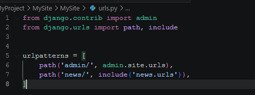

**Рисунок 9 — Подключение маршрутов приложения через include**

---

## 11. Проверка работы маршрутов

После настройки маршрутов был запущен сервер:

```bash
python manage.py runserver
```

Были проверены адреса:

```text
http://127.0.0.1:8000/news/
http://127.0.0.1:8000/news/test/
```

Первый адрес вызывает контроллер `index`, второй — контроллер `test`.

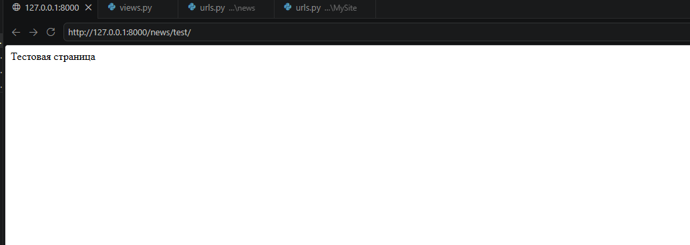

**Рисунок 10 — Проверка маршрута /news/test/**

При обращении к адресу, для которого маршрут не определен, Django возвращает ошибку `404 Page not found`.

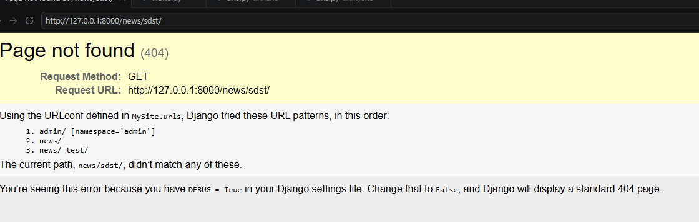

**Рисунок 11 — Ошибка 404 при обращении к несуществующему маршруту.**

---

## 12. Структура проекта

```text
MyProject/
│
├── venv/
│
└── MySite/
    ├── manage.py
    │
    ├── MySite/
    │   ├── __init__.py
    │   ├── settings.py
    │   ├── urls.py
    │   ├── asgi.py
    │   └── wsgi.py
    │
    └── news/
        ├── __init__.py
        ├── admin.py
        ├── apps.py
        ├── migrations/
        ├── models.py
        ├── tests.py
        ├── views.py
        └── urls.py
```

Основные элементы проекта:

- `venv` — виртуальное окружение Python;
- `manage.py` — файл управления Django-проектом;
- `settings.py` — настройки проекта;
- `urls.py` — маршруты проекта;
- `views.py` — контроллеры приложения;
- `news/urls.py` — маршруты приложения;
- `apps.py` — конфигурация приложения.

---

## 13. Контрольные вопросы

### 1. Что такое виртуальное окружение Python?

Виртуальное окружение — изолированная среда для установки библиотек и зависимостей конкретного Python-проекта.

### 2. Для чего используется команда `python -m venv venv`?

Она создает виртуальное окружение с именем `venv`.

### 3. Как активировать виртуальное окружение в Windows?

Для активации используется команда:

```bash
venv\Scripts\activate
```

### 4. Для чего используется Django?

Django — веб-фреймворк Python, предназначенный для разработки веб-приложений.

### 5. Для чего используется команда `django-admin startproject`?

Она создает новый Django-проект и его базовую структуру.

### 6. Для чего нужен файл `views.py`?

В файле `views.py` создаются контроллеры, которые обрабатывают HTTP-запросы и формируют ответы.

### 7. Что такое маршрут?

Маршрут определяет соответствие между URL-адресом и функцией, которая должна обработать запрос по этому адресу.

### 8. Для чего используется функция `path()`?

Функция `path()` позволяет определить URL-маршрут и связать его с соответствующим контроллером.

### 9. Для чего используется `include()`?

`include()` позволяет подключить маршруты отдельного приложения к основному файлу маршрутизации Django.

### 10. Что происходит при обращении к несуществующему адресу?

Если Django не находит подходящего маршрута, сервер возвращает ошибку HTTP 404 — `Page not found`.

---

## Заключение

В ходе лабораторной работы было создано виртуальное окружение Python и установлен фреймворк Django. Был создан Django-проект и приложение `news`.

В процессе работы были изучены контроллеры и маршрутизация Django. Был создан контроллер, возвращающий HTTP-ответ, а также несколько маршрутов, связывающих URL-адреса с соответствующими функциями.

Также была рассмотрена организация маршрутов непосредственно внутри приложения с использованием файла `urls.py` и функции `include()`. Работа маршрутов была проверена через браузер и терминал, а также рассмотрена обработка несуществующих URL-адресов с помощью ответа 404.

Таким образом, в ходе лабораторной работы были получены практические навыки создания виртуального окружения, настройки Django-проекта, разработки контроллеров и организации маршрутов веб-приложения.
